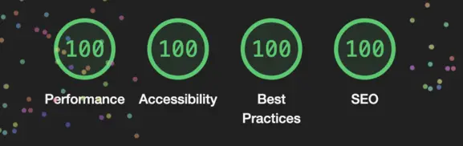

# Next.js PWA template

## Getting Started

This template was created to have a base for projects with PWA integrated by using [@serwist/next](https://serwist.pages.dev/).

This template also install `sass` for styling.

```
Use this template to bootstrap your <b>Next.js</b> web application
with <b>PWA</b> integrated and set to obtaing <b>100%</b> average on
<b>Lighthouse</b> reports
```

<center>




</center>
